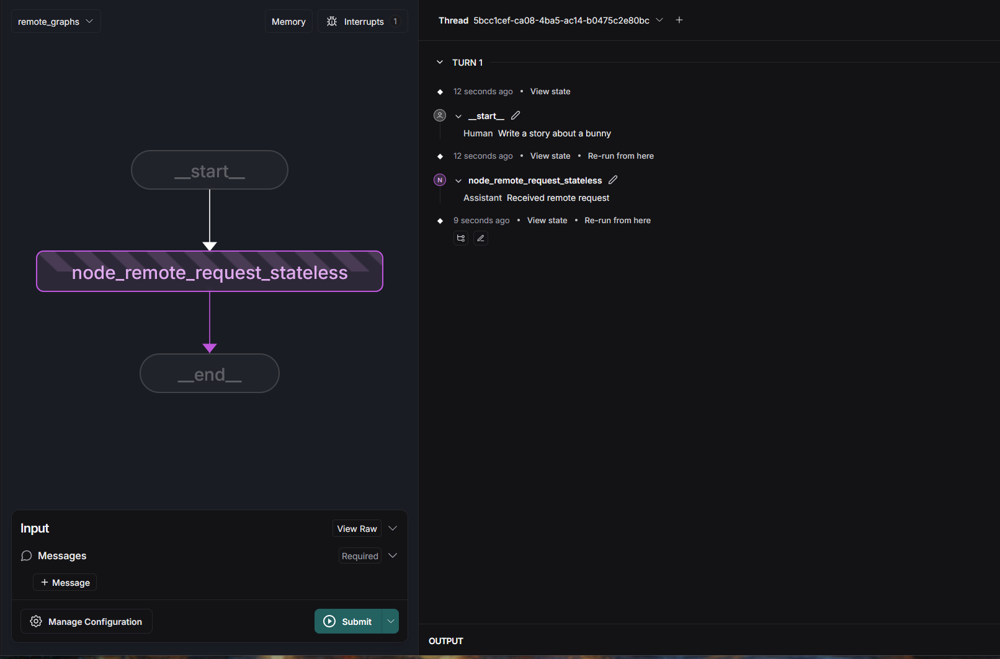

# remote_graphs

## Overview

This repository contains a Agent Protocol FastAPI application. It also includes examples of JSON-based logging, CORS configuration, and route tagging.

## Requirements

- Python 3.9+
- A virtual environment is recommended for isolating dependencies.

## Installation

1. Clone the repository:

   ```bash
   git clone https://github.com/brisacoder/remote_graphs/
   cd your-repo
   ```

2. Install the dependencies:

   ```bash
   pip install -r requirements.txt
   ```

## Environment Variables

The application uses a `.env` file for storing environment variables.

```bash
OPENAI_API_KEY=sk-<your key>
OPENAI_MODEL_NAME=gpt-4o
```

## Running the Application

You can run the application by executing:

```bash
python main.py
```

### Expected Console Output

On a successful run, you should see logs in your terminal similar to the snippet below. The exact timestamps, process IDs, and file paths will vary:

```bash
python .\main.py
{"timestamp": "2025-03-03 12:18:40,163", "level": "INFO", "message": "Logging is initialized. This should appear in the log file.", "module": "logging_config", "function": "configure_logging", "line": 142, "logger": "app", "pid": 25372}
{"timestamp": "2025-03-03 12:18:40,163", "level": "INFO", "message": "Starting FastAPI application...", "module": "main", "function": "main", "line": 203, "logger": "app", "pid": 25372}
{"timestamp": "2025-03-03 12:18:40,164", "level": "INFO", "message": ".env file loaded from .env", "module": "main", "function": "load_environment_variables", "line": 43, "logger": "root", "pid": 25372}    
INFO:     Started server process [25372]
INFO:     Waiting for application startup.
{"timestamp": "2025-03-03 12:18:40,192", "level": "INFO", "message": "Starting Remote Graphs App...", "module": "main", "function": "lifespan", "line": 67, "logger": "root", "pid": 25372}
INFO:     Application startup complete.
INFO:     Uvicorn running on http://0.0.0.0:8123 (Press CTRL+C to quit)
INFO:     Shutting down
INFO:     Waiting for application shutdown.
{"timestamp": "2025-03-03 12:18:52,935", "level": "INFO", "message": "Application shutdown", "module": "main", "function": "lifespan", "line": 74, "logger": "root", "pid": 25372}
INFO:     Application shutdown complete.
INFO:     Finished server process [25372]
```

This output confirms that:

1. Logging is properly initialized.
2. The server is listening on `0.0.0.0:8123`.
3. Your environment variables (like `.env file loaded`) are read.

## Logging

- **Format**: The application is configured to use JSON logging by default. Each log line provides a timestamp, log level, module name, and the message.
- **Location**: Logs typically go to stdout when running locally. If you configure a file handler or direct logs to a centralized logging solution, they can be written to a file (e.g., `logs/app.log`) or shipped to another service.
- **Customization**: You can change the log level (`info`, `debug`, etc.) or format by modifying environment variables or the logger configuration in your code. If you run in Docker or Kubernetes, ensure the logs are captured properly and aggregated where needed.

## API Endpoints

By default, the API documentation is available at:

```bash
http://0.0.0.0:8123/docs
```

(Adjust the host and port if you override them via environment variables.)

## Running as a LangGraph Studio

You need to install Rust: <https://www.rust-lang.org/tools/install>

Run the server

Change to `client` folder

```bash
langgraph dev
```



## Contributing

1. Fork the repository.
2. Create a feature branch.
3. Make your changes and ensure tests pass.
4. Submit a pull request.
